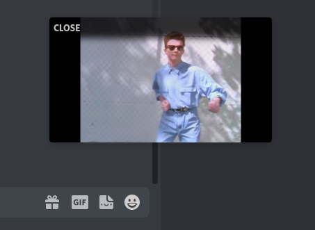

# PiPEmbeds

Annoyed that videos stop playing when you switch channels?

PiPEmbeds enables playback of embedded videos anywhere in Discord through the picture-in-picture window!

## Operation

To add a video to the picture-in-picture player, just start playing it and switch to a different channel or server.

To switch between multiple videos in the player, scroll up or down. To remove a video, click the "Close" button in the top corner.

## Supported Media

Currently Discord embed videos and YouTube videos are supported. I am open to add other media types given enough support and a working API for that platform.

## My Other Plugins
- [SplitLargeFiles](https://github.com/ImTheSquid/SplitLargeFiles)
- [StickerSnatcher](https://github.com/ImTheSquid/StickerSnatcher)
- [SettingsSync](https://github.com/ImTheSquid/SettingsSync)